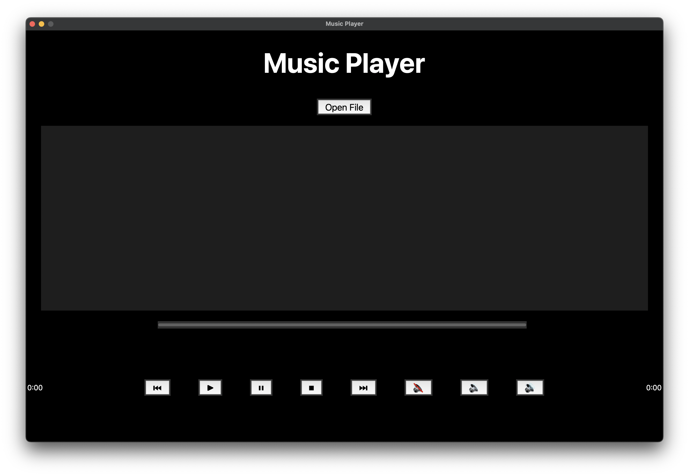

# Music Player

Un lecteur de musique simple avec des fonctionnalités de lecture, pause, arrêt, et plus encore.

## Fonctionnalités

- **Lecture audio**: Lire des fichiers audio au format MP3.
- **Barre de progression**: Visualiser la progression de la lecture.
- **Contrôle du volume**: Ajuster le volume et activer/désactiver le mode muet.
- **Navigation entre les pistes**: Passer à la piste précédente/suivante.
- **Sélection de fichiers individuels**: Choisissez des fichiers MP3 spécifiques au lieu d'un dossier entier.

## Utilisation

1. **Ouvrir des fichiers**:
   - Cliquez sur le bouton "Open File" pour sélectionner des fichiers MP3.
   - Choisissez plusieurs fichiers si vous le souhaitez.

2. **Lecture de musique**:
   - Sélectionnez une piste dans la liste.
   - Cliquez sur le bouton de lecture (▶) pour démarrer la lecture.

3. **Contrôles supplémentaires**:
   - Utilisez les boutons de contrôle pour mettre en pause (⏸), arrêter (⏹), passer à la piste précédente (⏮) ou suivante (⏭).

4. **Réglage du volume**:
   - Utilisez les boutons de volume (🔉 🔊) pour ajuster le volume.
   - Cliquez sur le bouton de sourdine (🔇) pour activer/désactiver le mode muet.